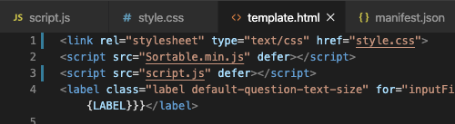
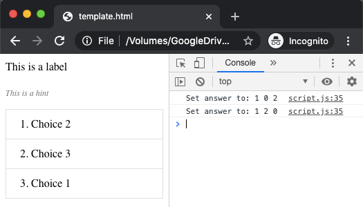

# Field plug-in tools

This is code you can add to field plug-ins so you can test them in a web browser before testing them your the SurveyCTO server. To learn more, check out our [guide to creating field plug-ins](https://support.surveycto.com/hc/en-us/articles/360052426933-Guide-to-creating-field-plug-ins).

## How to use

Simply add the [JavaScript code](/tools/script_testing.js) to the top of your JavaScript script, and the [HTML tags](/tools/template_testing.html) to the top of your HTML markup.

If you are using additional JavaScript files, add links to them as well:

    

When the setAnswer() function is called, then the developer console will say `Set answer to:`, followed by the answer the field was set to. When the goToNextField() function is called, then `Skipped to next field` will appear in the developer console.

Make sure you update the "fieldProperties" object with information related to your field plug-in. For example, if this is going to be used in a _text_ field, change the `FIELDTYPE` to 'text'. You can also add and remove properties that are and are not related to your field plug-in. Check out the [field plug-in API](https://github.com/surveycto/field-plug-in-resources/blob/master/docs/api-reference.md) to see which field properties are available for each field type.

Then, open the HTML file in a web browser, open the developer tools, and start testing!

When you are ready to merge the commits into the *master* branch, make sure you delete the testing code. Also re-compress the files into a ZIP file so the ZIP does not have unnecessary comments.

## Additional features

You can add additional features to the test code as necessary. There are two [commented-out](https://www.yourdictionary.com/comment-out) examples at the bottom of the script file.

**setFocus**: Uncomment this out if your script includes a setFocus() function, since that will be run when the field first appears.

**document.body.classList.add('android-collect')**: If your script should act differently depending on the platform, uncomment this row to test how your script acts on that platform. For example, if you would like to test how the form acts in web forms, uncomment out this row, and change `android-collect` to `web-collect`. See the [field plug-in API](https://github.com/surveycto/field-plug-in-resources/blob/master/docs/api-reference.md#user-content-css-classes) for more details.